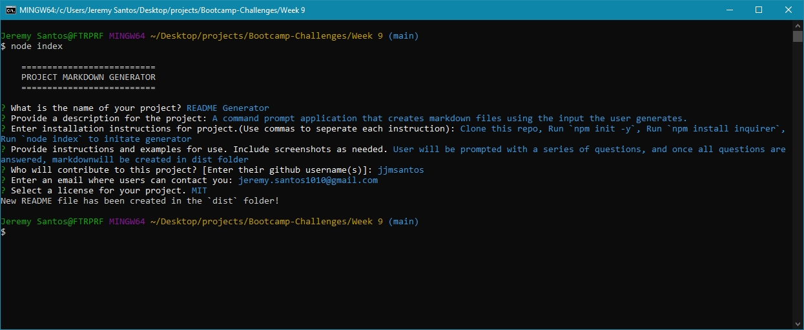

# README Generator

## Description

A command prompt application that creates markdown files using the input the user generates.

Powered by node.js, npm, inquirer

## Installation

To use this generator some steps are required to use:

1. Clone this repo
2. Run `npm init -y`
3. Run `npm install inquirer`
4. Run `node index` to initiate generator

## Usage

- User will be prompted with a series of questions(All required)
- Once all prompts are finished and complete, markdown file will be stored in the `dist` folder.

## Video Demo

Video demo of console prompts can be found on my google drive [HERE](https://drive.google.com/file/d/1e_SBZUoO5FQOJ_4tzTCwXiMuGthHgSFc/view?usp=sharing)
